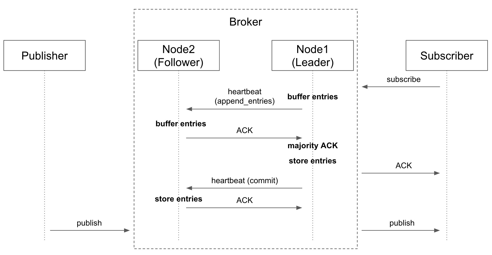
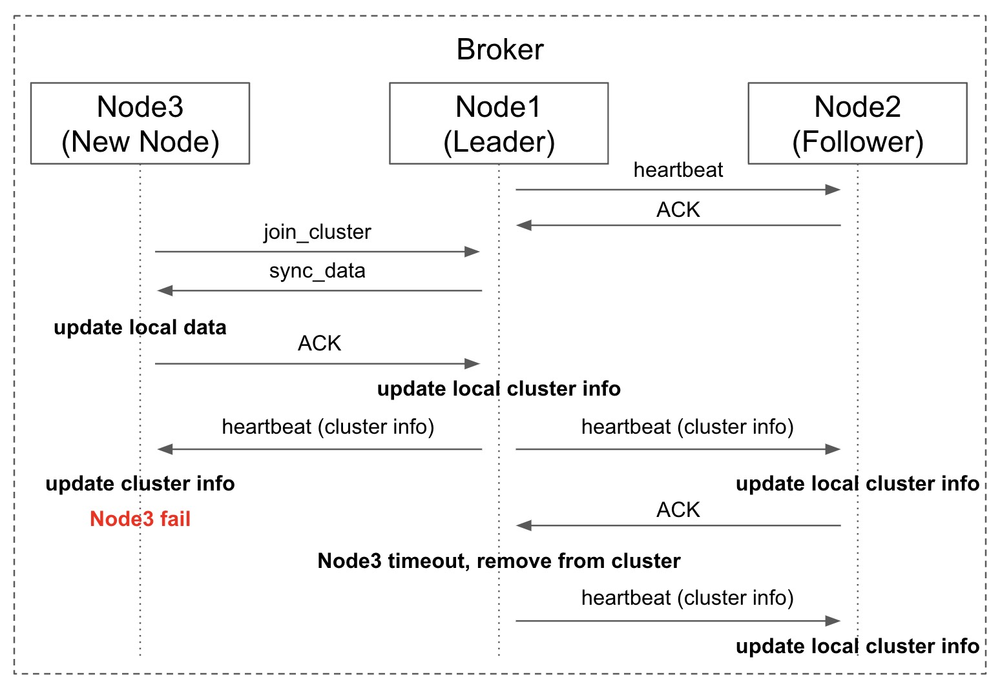

# Message Broker based on Raft Demo

## Introduction
This is an implementation demo of a distributed message broker based on the [Raft consensus algorithm](https://raft.github.io/).

This message broker is topic-based and distributed. Publishers can send messages on a specific topic, while subscribers can subscribe to multiple topics.


## Features

In this demo, the following mechanisms are implemented: leader election, log replication, and dynamic membership.

### Leader Election
- The leader needs to send heartbeats to all followers.
- Heartbeat messages carry information about all nodes in the cluster, allowing each node to have a complete overview of the cluster.
- Each node has a random timeout, and if it does not receive a heartbeat within that timeout, it becomes a candidate and votes for itself.
- Candidates send a `REQUEST_TO_VOTE` message, asking other nodes to vote for them. Each node can only vote once in a given election term.
- the candidate becomes the new leader when it receives the majority of votes.

### Log Replication
- An update request (Subscribe/Unsubscribe) is forwarded to the leader.
- The leader sends `append entries` messages to all followers along with heartbeats.
- When the majority of followers acknowledge (`ACK`) the `append entries` message, the leader appends the entries locally.
- Followers update their local entries upon receiving the next heartbeat after the `append entries` message.

### Dynamic Membership
#### Join
- When a new node wants to join, it sends a `JOIN_CLUSTER` message to one node in the cluster.
- The `JOIN_CLUSTER` message is forwarded to the leader. The leader then sends a `SYNC_DATA` message to the new node, allowing the new node to obtain all necessary data (e.g., subscribed topics).
- After updating its data, the new node sends an `ACK` to the leader and starts the election timeout mechanism.
- The leader adds the new node to the cluster information and send the information to all followers with each heartbeat.

#### Leave
- The leader sends heartbeats to followers, and if a follower refuses the connection or timeout, it indicates that the node has left the cluster.
- The leader updates the cluster information and sends it to all followers with each heartbeat.

## Run

### Enter Virtual Environment
```shell
python -m venv venv
source venv/bin/activate
pip install -r requirements.txt

# Run demo...
```

### Exit Environment
```shell
deactivate
rm -rf venv
```


## Demo

### Basic
```shell
python src/test_basic.py
```


```log
==================== Broker ====================
2023-05-24 17:39:53 [Broker 8000 FOLLOWER] INFO: Running on localhost:8000
2023-05-24 17:39:54 [Broker 8000 CANDIDATE] INFO: Timeout, sending REQUEST_TO_VOTE, term: 1
2023-05-24 17:39:54 [Broker 8000 LEADER] INFO: New leader localhost:8000


==================== Subscribe ====================
2023-05-24 17:39:54 [Subscriber 9000] INFO: Subscriber is running on localhost:9000
2023-05-24 17:39:54 [Subscriber 9000] INFO: SUBSCRIBE message on topic `topic1` at localhost:8000
2023-05-24 17:39:54 [Broker 8000 LEADER] INFO: New SUBSCRIBE to `topic1` from localhost:9000
2023-05-24 17:39:54 [Broker 8000 LEADER] INFO: Majority ACK, append entries
2023-05-24 17:39:54 [Broker 8000 LEADER] INFO: Handle append_entries: SUBSCRIBE on topic: `topic1` from localhost:9000
2023-05-24 17:39:54 [Subscriber 9000] INFO: Received ACK: subscribe on topic `topic1`


==================== Publish ====================
2023-05-24 17:39:55 [Publisher] INFO: Publish to topic `topic1`: `Hello, world!` at localhost:8000
2023-05-24 17:39:55 [Broker 8000 LEADER] INFO: New publish `topic1`: `Hello, world!`
2023-05-24 17:39:55 [Subscriber 9000] INFO: Received message: `Hello, world!` on topic `topic1`
```

### Broker Cluster (Log Replication)

#### One Subscriber
```shell
python src/test_cluster_pub_one_sub.py
```



```log
==================== Broker ====================
2023-05-24 18:06:39 [Broker 8000 FOLLOWER] INFO: Running on localhost:8000
2023-05-24 18:06:39 [Broker 8001 FOLLOWER] INFO: Running on localhost:8001
2023-05-24 18:06:39 [Broker 8000 CANDIDATE] INFO: Timeout, sending REQUEST_TO_VOTE, term: 1
2023-05-24 18:06:39 [Broker 8001 FOLLOWER] INFO: Vote to leader localhost:8000, term: 1
2023-05-24 18:06:39 [Broker 8000 LEADER] INFO: New leader localhost:8000


==================== Subscribe to Node 1 ====================
2023-05-24 18:06:41 [Subscriber 9000] INFO: Subscriber is running on localhost:9000
2023-05-24 18:06:41 [Subscriber 9000] INFO: SUBSCRIBE message on topic `topic1` at localhost:8000
2023-05-24 18:06:41 [Broker 8000 LEADER] INFO: New SUBSCRIBE to `topic1` from localhost:9000
2023-05-24 18:06:41 [Broker 8001 FOLLOWER] INFO: Received append_entries, store in buffer
2023-05-24 18:06:41 [Broker 8000 LEADER] INFO: Majority ACK, append entries
2023-05-24 18:06:41 [Broker 8000 LEADER] INFO: Handle append_entries: SUBSCRIBE on topic: `topic1` from localhost:9000
2023-05-24 18:06:41 [Subscriber 9000] INFO: Received ACK: subscribe on topic `topic1`
2023-05-24 18:06:42 [Broker 8001 FOLLOWER] INFO: Handle append_entries: SUBSCRIBE on topic: `topic1` from localhost:9000


==================== Publish to Node 2 ====================
2023-05-24 18:06:42 [Publisher] INFO: Publish to topic `topic1`: `Hello, world!` at localhost:8001
2023-05-24 18:06:42 [Broker 8001 FOLLOWER] INFO: New publish `topic1`: `Hello, world!`
2023-05-24 18:06:42 [Subscriber 9000] INFO: Received message: `Hello, world!` on topic `topic1`


==================== Unsubscribe and Publish ====================
2023-05-24 18:06:43 [Subscriber 9000] INFO: UNSUBSCRIBE message on topic `topic1` at localhost:8000


==================== Publish (Temporary inconsistent) ====================
2023-05-24 18:06:43 [Publisher] INFO: Publish to topic `topic1`: `Hello, too fast` at localhost:8001
2023-05-24 18:06:43 [Broker 8000 LEADER] INFO: New UNSUBSCRIBE to `topic1` from localhost:9000
2023-05-24 18:06:43 [Broker 8001 FOLLOWER] INFO: New publish `topic1`: `Hello, too fast`
2023-05-24 18:06:43 [Subscriber 9000] INFO: Received message: `Hello, too fast` on topic `topic1`
2023-05-24 18:06:43 [Broker 8001 FOLLOWER] INFO: Received append_entries, store in buffer
2023-05-24 18:06:43 [Broker 8000 LEADER] INFO: Majority ACK, append entries
2023-05-24 18:06:43 [Broker 8000 LEADER] INFO: Handle append_entries: UNSUBSCRIBE on topic: `topic1` from localhost:9000
2023-05-24 18:06:43 [Subscriber 9000] INFO: Received ACK: unsubscribe on topic `topic1`
2023-05-24 18:06:43 [Broker 8001 FOLLOWER] INFO: Handle append_entries: UNSUBSCRIBE on topic: `topic1` from localhost:9000


==================== Publish Later ====================
2023-05-24 18:06:44 [Publisher] INFO: Publish to topic `topic1`: `Hello, later` at localhost:8001
2023-05-24 18:06:44 [Broker 8001 FOLLOWER] INFO: New publish `topic1`: `Hello, later`
```

#### Two Subscribers
```shell
python src/test_cluster_pub_two_sub.py
```
```log
==================== Broker ====================
2023-05-24 18:07:21 [Broker 8000 FOLLOWER] INFO: Running on localhost:8000
2023-05-24 18:07:21 [Broker 8001 FOLLOWER] INFO: Running on localhost:8001
2023-05-24 18:07:22 [Broker 8000 CANDIDATE] INFO: Timeout, sending REQUEST_TO_VOTE, term: 1
2023-05-24 18:07:22 [Broker 8001 FOLLOWER] INFO: Vote to leader localhost:8000, term: 1
2023-05-24 18:07:22 [Broker 8000 LEADER] INFO: New leader localhost:8000


==================== Subscribe to Node 1 ====================
2023-05-24 18:07:24 [Subscriber 9000] INFO: Subscriber is running on localhost:9000
2023-05-24 18:07:24 [Subscriber 9000] INFO: SUBSCRIBE message on topic `topic1` at localhost:8000
2023-05-24 18:07:24 [Broker 8000 LEADER] INFO: New SUBSCRIBE to `topic1` from localhost:9000


==================== Subscribe to Node 2 ====================
2023-05-24 18:07:24 [Subscriber 9005] INFO: Subscriber is running on localhost:9005
2023-05-24 18:07:24 [Subscriber 9005] INFO: SUBSCRIBE message on topic `topic1` at localhost:8001
2023-05-24 18:07:24 [Broker 8001 FOLLOWER] INFO: Forward SUBSCRIBE to leader: ('localhost', 8000)
2023-05-24 18:07:24 [Broker 8000 LEADER] INFO: New SUBSCRIBE to `topic1` from localhost:9005
2023-05-24 18:07:24 [Broker 8001 FOLLOWER] INFO: Received append_entries, store in buffer
2023-05-24 18:07:24 [Broker 8000 LEADER] INFO: Majority ACK, append entries
2023-05-24 18:07:24 [Broker 8000 LEADER] INFO: Handle append_entries: SUBSCRIBE on topic: `topic1` from localhost:9000
2023-05-24 18:07:24 [Subscriber 9000] INFO: Received ACK: subscribe on topic `topic1`
2023-05-24 18:07:24 [Broker 8001 FOLLOWER] INFO: Handle append_entries: SUBSCRIBE on topic: `topic1` from localhost:9000
2023-05-24 18:07:24 [Broker 8000 LEADER] INFO: Majority ACK, append entries
2023-05-24 18:07:24 [Broker 8001 FOLLOWER] INFO: Received append_entries, store in buffer
2023-05-24 18:07:24 [Broker 8000 LEADER] INFO: Handle append_entries: SUBSCRIBE on topic: `topic1` from localhost:9005
2023-05-24 18:07:24 [Subscriber 9005] INFO: Received ACK: subscribe on topic `topic1`
2023-05-24 18:07:24 [Broker 8001 FOLLOWER] INFO: Handle append_entries: SUBSCRIBE on topic: `topic1` from localhost:9005


==================== Publish to Node 2 ====================
2023-05-24 18:07:25 [Publisher] INFO: Publish to topic `topic1`: `Hello, world!` at localhost:8001
2023-05-24 18:07:25 [Broker 8001 FOLLOWER] INFO: New publish `topic1`: `Hello, world!`
2023-05-24 18:07:25 [Subscriber 9005] INFO: Received message: `Hello, world!` on topic `topic1`
2023-05-24 18:07:25 [Subscriber 9000] INFO: Received message: `Hello, world!` on topic `topic1`


==================== Unsubscribe and Publish ====================
2023-05-24 18:07:26 [Subscriber 9000] INFO: UNSUBSCRIBE message on topic `topic1` at localhost:8000


==================== Publish (Temporary inconsistent) ====================
2023-05-24 18:07:26 [Broker 8000 LEADER] INFO: New UNSUBSCRIBE to `topic1` from localhost:9000
2023-05-24 18:07:26 [Publisher] INFO: Publish to topic `topic1`: `Hello, too fast` at localhost:8001
2023-05-24 18:07:26 [Broker 8001 FOLLOWER] INFO: New publish `topic1`: `Hello, too fast`
2023-05-24 18:07:26 [Subscriber 9005] INFO: Received message: `Hello, too fast` on topic `topic1`
2023-05-24 18:07:26 [Subscriber 9000] INFO: Received message: `Hello, too fast` on topic `topic1`
2023-05-24 18:07:26 [Broker 8001 FOLLOWER] INFO: Received append_entries, store in buffer
2023-05-24 18:07:26 [Broker 8000 LEADER] INFO: Majority ACK, append entries
2023-05-24 18:07:26 [Broker 8000 LEADER] INFO: Handle append_entries: UNSUBSCRIBE on topic: `topic1` from localhost:9000
2023-05-24 18:07:26 [Subscriber 9000] INFO: Received ACK: unsubscribe on topic `topic1`
2023-05-24 18:07:26 [Broker 8001 FOLLOWER] INFO: Handle append_entries: UNSUBSCRIBE on topic: `topic1` from localhost:9000


==================== Publish Later ====================
2023-05-24 18:07:26 [Publisher] INFO: Publish to topic `topic1`: `Hello, later` at localhost:8001
2023-05-24 18:07:26 [Broker 8001 FOLLOWER] INFO: New publish `topic1`: `Hello, later`
2023-05-24 18:07:26 [Subscriber 9005] INFO: Received message: `Hello, later` on topic `topic1`
```

### Broker Cluster Features
#### Fault Tolerance
```shell
python src/test_cluster_false_tolerant.py
```


```log
==================== Broker ====================
2023-05-24 18:03:41 [Broker 8000 FOLLOWER] INFO: Running on localhost:8000
2023-05-24 18:03:41 [Broker 8001 FOLLOWER] INFO: Running on localhost:8001
2023-05-24 18:03:41 [Broker 8002 FOLLOWER] INFO: Running on localhost:8002
2023-05-24 18:03:42 [Broker 8000 CANDIDATE] INFO: Timeout, sending REQUEST_TO_VOTE, term: 1
2023-05-24 18:03:42 [Broker 8002 FOLLOWER] INFO: Vote to leader localhost:8000, term: 1
2023-05-24 18:03:42 [Broker 8000 LEADER] INFO: New leader localhost:8000
2023-05-24 18:03:42 [Broker 8001 FOLLOWER] INFO: Vote to leader localhost:8000, term: 1


==================== Leader Fail ====================
2023-05-24 18:03:44 [Broker 8001 CANDIDATE] INFO: Timeout, sending REQUEST_TO_VOTE, term: 2
2023-05-24 18:03:44 [Broker 8001 CANDIDATE] INFO: Node leave the cluster: localhost:8000
2023-05-24 18:03:44 [Broker 8002 FOLLOWER] INFO: Vote to leader localhost:8001, term: 2
2023-05-24 18:03:44 [Broker 8001 LEADER] INFO: New leader localhost:8001
```
#### Dynamic Membership
```shell
python src/test_cluster_dynamic_membership.py
```



```log
==================== Broker ====================
2023-05-24 18:04:26 [Broker 8000 FOLLOWER] INFO: Running on localhost:8000
2023-05-24 18:04:26 [Broker 8001 FOLLOWER] INFO: Running on localhost:8001
2023-05-24 18:04:27 [Broker 8000 CANDIDATE] INFO: Timeout, sending REQUEST_TO_VOTE, term: 1
2023-05-24 18:04:27 [Broker 8001 FOLLOWER] INFO: Vote to leader localhost:8000, term: 1
2023-05-24 18:04:27 [Broker 8000 LEADER] INFO: New leader localhost:8000


==================== Node Join ====================
2023-05-24 18:04:28 [Broker 8003 FOLLOWER] INFO: Running on localhost:8003
2023-05-24 18:04:28 [Broker 8003 FOLLOWER] INFO: Request JOIN_CLUSTER localhost:8001
2023-05-24 18:04:28 [Broker 8001 FOLLOWER] INFO: Forward JOIN_CLUSTER to leader: ('localhost', 8000)
2023-05-24 18:04:28 [Broker 8000 LEADER] INFO: Sync data with peer localhost:8003
2023-05-24 18:04:28 [Broker 8000 LEADER] INFO: New node joins the cluster localhost:8003


==================== Node Leave ====================
2023-05-24 18:04:31 [Broker 8000 LEADER] INFO: Node leave the cluster: localhost:8003
```

#### Dynamic Membership (pub-sub)
```shell
python src/test_cluster_dynamic_membership_pub_sub.py
```
```log
==================== Broker ====================
2023-05-24 18:05:01 [Broker 8000 FOLLOWER] INFO: Running on localhost:8000
2023-05-24 18:05:01 [Broker 8001 FOLLOWER] INFO: Running on localhost:8001
2023-05-24 18:05:02 [Broker 8000 CANDIDATE] INFO: Timeout, sending REQUEST_TO_VOTE, term: 1
2023-05-24 18:05:02 [Broker 8001 FOLLOWER] INFO: Vote to leader localhost:8000, term: 1
2023-05-24 18:05:02 [Broker 8000 LEADER] INFO: New leader localhost:8000


==================== Subscribe to Node 1 ====================
2023-05-24 18:05:03 [Subscriber 9000] INFO: Subscriber is running on localhost:9000
2023-05-24 18:05:03 [Subscriber 9000] INFO: SUBSCRIBE message on topic `topic1` at localhost:8000
2023-05-24 18:05:03 [Broker 8000 LEADER] INFO: New SUBSCRIBE to `topic1` from localhost:9000
2023-05-24 18:05:03 [Broker 8001 FOLLOWER] INFO: Received append_entries, store in buffer
2023-05-24 18:05:03 [Broker 8000 LEADER] INFO: Majority ACK, append entries
2023-05-24 18:05:03 [Broker 8000 LEADER] INFO: Handle append_entries: SUBSCRIBE on topic: `topic1` from localhost:9000
2023-05-24 18:05:03 [Subscriber 9000] INFO: Received ACK: subscribe on topic `topic1`
2023-05-24 18:05:04 [Broker 8001 FOLLOWER] INFO: Handle append_entries: SUBSCRIBE on topic: `topic1` from localhost:9000


==================== Node Join ====================
2023-05-24 18:05:04 [Broker 8006 FOLLOWER] INFO: Running on localhost:8006
2023-05-24 18:05:04 [Broker 8006 FOLLOWER] INFO: Request JOIN_CLUSTER localhost:8001
2023-05-24 18:05:04 [Broker 8001 FOLLOWER] INFO: Forward JOIN_CLUSTER to leader: ('localhost', 8000)
2023-05-24 18:05:04 [Broker 8000 LEADER] INFO: Sync data with peer localhost:8006
2023-05-24 18:05:04 [Broker 8000 LEADER] INFO: New node joins the cluster localhost:8006


==================== Publish to New Node ====================
2023-05-24 18:05:06 [Publisher] INFO: Publish to topic `topic1`: `Hello, world!` at localhost:8006
2023-05-24 18:05:06 [Broker 8006 FOLLOWER] INFO: New publish `topic1`: `Hello, world!`
2023-05-24 18:05:06 [Subscriber 9000] INFO: Received message: `Hello, world!` on topic `topic1`


==================== Node Leave ====================
2023-05-24 18:05:07 [Broker 8000 LEADER] INFO: Node leave the cluster: localhost:8006
```

#### Heartbeat (Leader Election)
```shell
python src/test_cluster_heartbeat.py
```


```log
==================== Same Election Timeout ====================
2023-05-24 18:08:14 [Broker 8000 FOLLOWER] INFO: Running on localhost:8000
2023-05-24 18:08:14 [Broker 8001 FOLLOWER] INFO: Running on localhost:8001
2023-05-24 18:08:15 [Broker 8000 CANDIDATE] INFO: Timeout, sending REQUEST_TO_VOTE, term: 1
2023-05-24 18:08:15 [Broker 8001 CANDIDATE] INFO: Timeout, sending REQUEST_TO_VOTE, term: 1
2023-05-24 18:08:15 [Broker 8001 CANDIDATE] DEBUG: Send REQUEST_TO_VOTE to localhost:8000
2023-05-24 18:08:15 [Broker 8000 CANDIDATE] DEBUG: Send REQUEST_TO_VOTE to localhost:8001
2023-05-24 18:08:15 [Broker 8000 CANDIDATE] INFO: Timeout, sending REQUEST_TO_VOTE, term: 2
2023-05-24 18:08:15 [Broker 8001 CANDIDATE] INFO: Timeout, sending REQUEST_TO_VOTE, term: 2
2023-05-24 18:08:15 [Broker 8000 CANDIDATE] DEBUG: Send REQUEST_TO_VOTE to localhost:8001
2023-05-24 18:08:15 [Broker 8001 CANDIDATE] DEBUG: Send REQUEST_TO_VOTE to localhost:8000


==================== Different Election Timeout ====================
2023-05-24 18:08:16 [Broker 8100 FOLLOWER] INFO: Running on localhost:8100
2023-05-24 18:08:16 [Broker 8101 FOLLOWER] INFO: Running on localhost:8101
2023-05-24 18:08:16 [Broker 8100 CANDIDATE] INFO: Timeout, sending REQUEST_TO_VOTE, term: 1
2023-05-24 18:08:16 [Broker 8100 CANDIDATE] DEBUG: Send REQUEST_TO_VOTE to localhost:8101
2023-05-24 18:08:16 [Broker 8101 FOLLOWER] INFO: Vote to leader localhost:8100, term: 1
2023-05-24 18:08:16 [Broker 8100 CANDIDATE] DEBUG: Be voted by localhost:8101
2023-05-24 18:08:16 [Broker 8100 LEADER] INFO: New leader localhost:8100
2023-05-24 18:08:16 [Broker 8100 LEADER] DEBUG: Send heartbeat to peer localhost:8101
2023-05-24 18:08:16 [Broker 8101 FOLLOWER] DEBUG: Received heartbeat from localhost:8100, send ACK back
2023-05-24 18:08:16 [Broker 8100 LEADER] DEBUG: Received ACK from localhost:8101
2023-05-24 18:08:17 [Broker 8100 LEADER] DEBUG: Send heartbeat to peer localhost:8101
2023-05-24 18:08:17 [Broker 8101 FOLLOWER] DEBUG: Received heartbeat from localhost:8100, send ACK back
2023-05-24 18:08:17 [Broker 8100 LEADER] DEBUG: Received ACK from localhost:8101
2023-05-24 18:08:17 [Broker 8100 LEADER] DEBUG: Send heartbeat to peer localhost:8101
2023-05-24 18:08:17 [Broker 8101 FOLLOWER] DEBUG: Received heartbeat from localhost:8100, send ACK back
2023-05-24 18:08:17 [Broker 8100 LEADER] DEBUG: Received ACK from localhost:8101
```

## Limitations
### Cluster Node Temporarily Unavailable
- If a node is temporarily unavailable and gets kicked from the cluster, there is no mechanism to gracefully re-join the cluster.

### Message Cache Mechanism
- The broker did not implement a message cache mechanism.
- If a subscriber is unavailable when a message is published, the subscriber will lose the message.
- Implementing a message cache mechanism in a cluster is not easy. The challenge lies in notifying all nodes about the cached messages.
  - When a publish message fails to deliver, we need to forward the failed message to the leader and then notify all nodes to update.
  - When a cached message is re-published, we need to delete the cached message and let the leader notify all nodes to update.